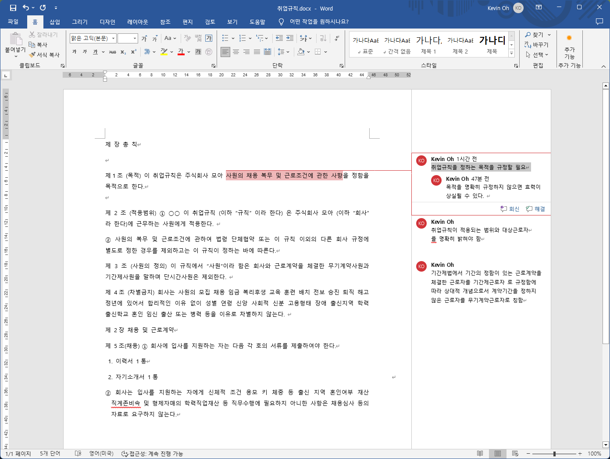

# 워드 문서에서 Comment(메모) 내용을 뽑아내는 샘플 코드

## 샘플 워드 문서 (취업규칙.docx)



## 실행결과 

```
D:\source\docx-comment\DocxComment\bin\Debug\net8.0\취업규칙.docx is processing
 ----------- Kevin Oh / 2024-06-05 오전 9:38:00 -----------
본문: 사원의 채용 복무 및 근로조건에 관한 사항
Comment
취업규칙을 정하는 목적을 규정할 필요
 ----------- Kevin Oh / 2024-06-05 오전 10:15:00 -----------
본문: 사원의 채용 복무 및 근로조건에 관한 사항
Comment
목적을 명확히 규정하지 않으면 효력이 상실될 수 있다.
 ----------- Kevin Oh / 2024-06-05 오전 9:38:00 -----------
본문: 사원에게 적용한다
Comment
취업규칙이 적용되는 범위와 대상근로자
를 명확히 밝혀야 함
 ----------- Kevin Oh / 2024-06-05 오전 9:39:00 -----------
본문:  회사와 근로계약을 체결한 무기계약사원과 기간제사원을 말하며 단시간사원은 제외
Comment
기간제법에서 기간의 정함이 있는 근로계약을 체결한 근로자를 기간제근로자 로 규정함에 따라 상대적 개념으로서 계약기간을 정하지 않은 근로자를 무기계약근로자로 칭함
```

## 실행환경 

- Windows 11
- Office Word 설치 
- Visual Studio 
- Programmin Language: C#
- Library : [Microsoft.Office.Interop.Word](https://www.nuget.org/packages/Microsoft.Office.Interop.Word/15.0.4797.1004?_src=template) / [MicrosoftOfficeCore](https://www.nuget.org/packages/MicrosoftOfficeCore/15.0.0?_src=template)